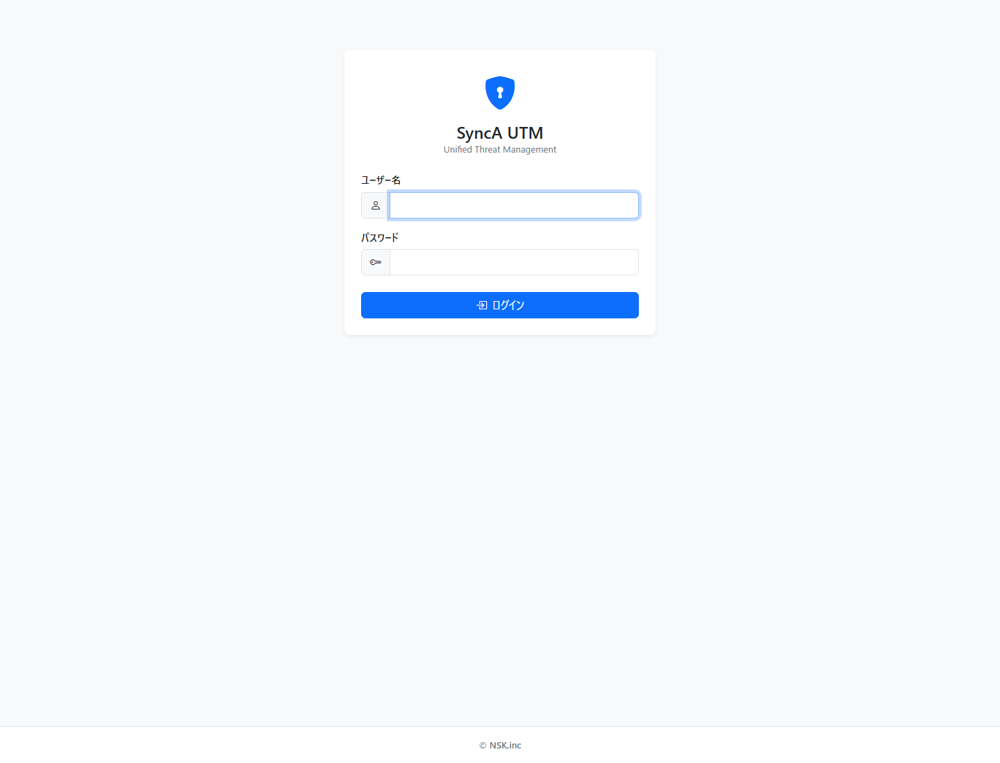
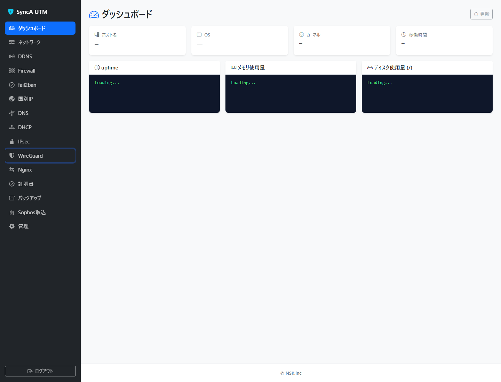
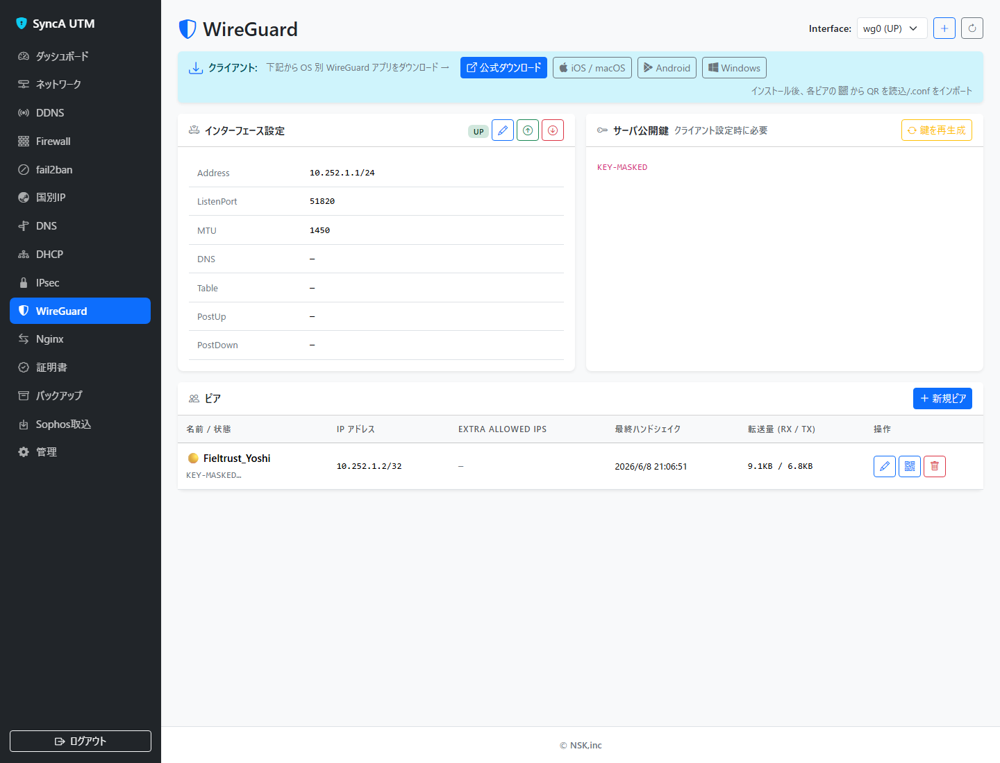
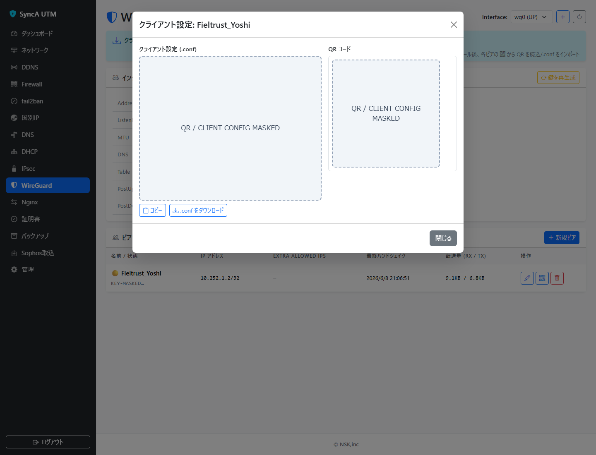

# WireGuardリモートアクセス利用手順書（lifecorputm例）

ファイル: `docs/manuals/wireguard-remote-access-lifecorputm.md`

目的: SyncA UTMの管理画面でWireGuard接続情報を確認し、スマートフォンまたはPCから社内ネットワークへ安全にリモートアクセスする手順を説明します。

対象URL: `https://lifecorputm.ddnsft.com:4444`

## 最重要の注意

この手順で触ってよい場所は、管理画面左側メニューの `WireGuard` だけです。

以下の画面やボタンは、管理者から明確な指示がない限り触らないでください。

- `ネットワーク`
- `Firewall`
- `DHCP`
- `DNS`
- `IPsec`
- `fail2ban`
- `Nginx`
- `証明書`
- `管理`
- `WireGuard` 画面内の鉛筆ボタン
- `WireGuard` 画面内のゴミ箱ボタン
- `WireGuard` 画面内の `鍵を再生成`
- `WireGuard` 画面内の `新規ピア`
- `Interface` の切り替え

特に、`wg0` やスタティックルートを `ネットワーク` 画面から変更しないでください。WireGuard接続ができなくなる原因になります。

## 事前に準備するもの

- 管理者から配布されたユーザー名とパスワード
- インターネットに接続できるスマートフォンまたはPC
- WireGuardアプリ
- 管理者から指定された自分用のピア名

WireGuardアプリをまだ入れていない場合は、先にインストールしてください。

- iPhone / iPad: App Storeで `WireGuard` を検索してインストール
- Android: Google Playで `WireGuard` を検索してインストール
- Windows: WireGuard公式サイトからWindows版をインストール

## 1. 管理画面へログインする

ブラウザで次のURLを開きます。

`https://lifecorputm.ddnsft.com:4444`

ログイン画面が表示されたら、管理者から配布されたユーザー名とパスワードを入力し、`ログイン` を押します。

## 2. 左側メニューのWireGuardだけを開く

ログイン後、左側メニューの `WireGuard` をクリックします。

他のメニューは開かないでください。

## 3. WireGuard画面で状態を確認する

WireGuard画面が開いたら、右上の `Interface` が `wg0 (UP)` になっていることを確認します。

下部の `ピア` 一覧に、自分用のピア名が表示されていることを確認します。

この例では `Fieltrust_Yoshi` が表示されています。実際の作業では、管理者から指定された自分用の名前を探してください。

この画面で押してよいのは、ピア行の中央にあるQRコードのボタンだけです。

- 青い鉛筆ボタン: 押さない
- 青いQRコードボタン: 必要なときだけ押す
- 赤いゴミ箱ボタン: 絶対に押さない

## 4. QRコードまたは設定ファイルを表示する

自分用のピア行にあるQRコードのボタンを押します。

`クライアント設定` と `QRコード` が表示されます。

画像ではQRコードと設定内容を伏せています。実際の画面では、ここに接続用のQRコードと設定ファイルが表示されます。

QRコードや `.conf` ファイルは、VPN接続の鍵です。他の人に送らないでください。複数人で同じQRコードを使い回さないでください。

## 5. スマートフォンで接続する場合

スマートフォンでWireGuardアプリを開きます。

次の順番で操作します。

1. WireGuardアプリを開く
2. `+` を押す
3. `QRコードから作成` または `QRコードをスキャン` を選ぶ
4. 管理画面に表示されているQRコードを読み取る
5. トンネル名を入力する
6. 作成されたトンネルをオンにする

接続中は、WireGuardアプリのトンネルがオンになります。

## 6. Windows PCで接続する場合

WindowsでWireGuardアプリを開きます。

次の順番で操作します。

1. 管理画面の `クライアント設定` 画面で `.conf をダウンロード` を押す
2. WireGuardアプリを開く
3. `トンネルをインポート` を押す
4. ダウンロードした `.conf` ファイルを選ぶ
5. 作成されたトンネルを `有効化` する

`.conf` ファイルもVPN接続の鍵です。メールやチャットで不用意に送らないでください。

## 7. 接続できたか確認する

WireGuardをオンにした後、管理者から指定された社内システムを開きます。

確認先の例:

- `192.168.11.1`
- 管理者から指定された社内Webシステム
- 管理者から指定された社内サーバー

開けない場合でも、SyncA UTMの設定画面を変更しないでください。

## 8. 接続を終了する

作業が終わったら、WireGuardアプリでトンネルをオフにします。

常時接続が必要かどうかは、管理者の指示に従ってください。

## うまく接続できない場合

利用者側で確認してよい内容は次の範囲だけです。

- スマートフォンまたはPCがインターネットに接続できているか
- WireGuardアプリのトンネルがオンになっているか
- 正しいトンネルを選んでいるか
- 端末の日時が大きくずれていないか
- 一度オフにして、数秒待ってからオンにしても同じか

それでも接続できない場合は、次の情報を管理者へ伝えてください。

- 作業した日時
- 利用端末の種類
- 自分用のピア名
- 表示されたエラー文
- WireGuardアプリの画面スクリーンショット

## 絶対に行わないこと

- `ネットワーク` 画面で `wg0` を編集しない
- スタティックルートを追加しない
- `WireGuard` 画面のゴミ箱ボタンを押さない
- `鍵を再生成` を押さない
- 他人のピアのQRコードを読み込まない
- 自分のQRコードや `.conf` ファイルを他人に渡さない
- エラーが出たからといって、管理画面の設定を試しに変更しない

誤って押した、または設定を変えた可能性がある場合は、その時刻と押した場所を記録して管理者へ連絡してください。
